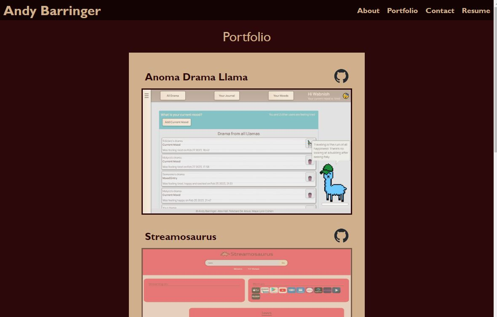

# Portfolio

## Description

- What was your motivation?
  - I wanted to improve on my original portfolio.
- Why did you build this project?
  - To learn about React and create a portfolio.
- What problem does it solve?
  - It provides a better place to see my work.
- What did you learn?
  - I learned how to effectively use React

## Installation

- Installation not required
- Follow this link: https://portfolio-wabarringer.herokuapp.com/

## Usage

- When visiting the site you are directed to the about me page. The nav tabs on the top right will help you get to the other pages.

- The portfolio page includes six of my projects with title and github repo links. Clicking the image will take you to the project site.

- The contact page has a form that, although not fully functioning, will notify you if any field is missing and if the email is the incorrect format. There is also a link that will open the user's default email application and prefill my email address in the 'to' field.

- The resume page includes the coding languages and skills I'm proficient with. The is a button that will download a copy of my resume.

- 

## Credits

N/A

## License

N/A
